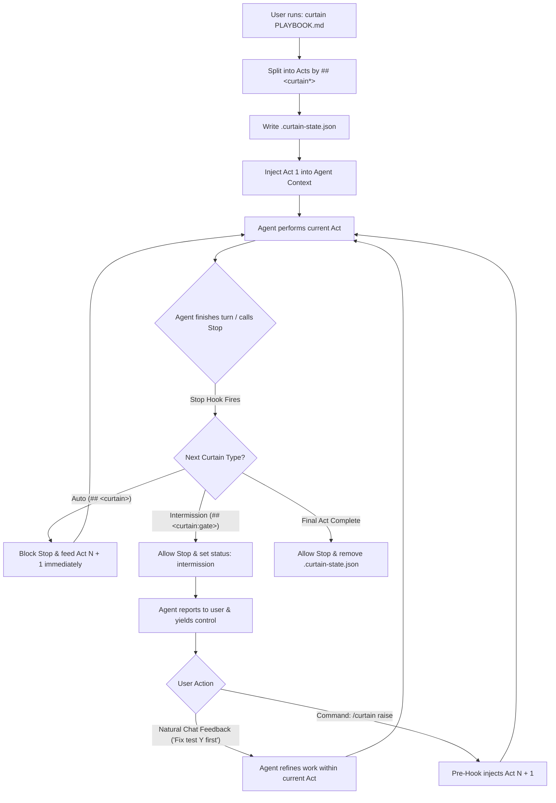

# Curtain (`@lukstei/curtain`)

> Minimal multi-act instruction runner for AI agents. Prevents skip-ahead by physically withholding future instructions behind theatrical curtains.

---

## 1. Problem Statement & Core Concept

When an AI agent receives a multi-phase task in a single prompt or file:
```markdown
Phase 1: Write failing tests. Do not proceed until verified.
Phase 2: Implement minimal fix.
Phase 3: Update documentation and release notes.
```
LLMs routinely disregard instructions to stop. They anticipate downstream phases, skip verification, cut corners, and attempt all phases in a single unconstrained blast.

**Prompting does not fix this.** If tokens exist in the context window, the model can and will attend to them.

**Curtain** solves this by physically withholding future instructions from the context window:
- A playbook is structured like a play divided into **Acts**.
- The agent only ever receives the text for the **current Act**.
- Between Acts hangs a **curtain**.
- An agent physically cannot skip ahead because downstream tokens do not exist in its prompt window.

---

## 2. Syntax & Delimiters

Playbooks and skills are standard Markdown files separated by GitHub-style callout alert blockquotes:

### 1. `> [!CURTAIN]` — Automatic Transition
A transition concluding tightly coupled phases (e.g., between scaffolding and testing). When the agent finishes Act 1 and attempts to conclude its turn, the `Stop` hook automatically intercepts termination, raises the curtain, and feeds Act 2. Supports optional transition criteria instructions:
```markdown
> [!CURTAIN] Verify build artifacts before advancing
```

### 2. `> [!INTERMISSION]` — Intermission Gate (Human Review)
An intermission for human-in-the-loop verification concluding the active Act. The `Stop` hook permits the agent to stop its turn, present its findings, and yield control to the developer. During review, user feedback messages automatically replay the intermission instruction. The next Act is only injected when the developer explicitly raises the curtain (`/curtain raise`).
```markdown
> [!INTERMISSION] Verify migration results
> Check table indexes and query latency before proceeding.
```

### Example Playbook (`PLAYBOOK.md`)
```markdown
# Database Migration Playbook

## Act 1: Schema Audit & Draft Migration
Audit existing tables in `src/db/schema.ts`. Write a non-destructive migration script in `migrations/002_user_prefs.sql`.
Do not apply the migration yet.

> [!INTERMISSION] Review migration SQL
> Ensure all columns have default values and no destructive DROP operations exist.

## Act 2: Local Verification
Run the migration script against local test Postgres container. Run existing test suite to check for regressions.

> [!CURTAIN]

## Act 3: Cleanup & Documentation
Update the ORM models and export types. Update schema docs in `docs/db.md`.
```

---

## 3. Platform Architecture & The Two-Hook Pairing

### Why "Just One Hook" Is Not Enough
In major agent platforms (Claude Code, Google Antigravity, OpenAI Codex):
- **User prompts are immutable.** A pre-invocation hook (`UserPromptSubmit` / `PreInvocation`) can append context, but it cannot truncate or redact text the user already typed into the chat window.
- **Stop hooks run too late.** A `Stop` hook runs *after* the agent has concluded its turn. If the user pasted the entire script upfront, the agent has already executed all phases before `Stop` ever runs.

### The Solution: 2-Touchpoint Pairing
Curtain pairs an entry command with a `Stop` hook (identical to how `ralph-loop` operates):



---

## 4. Commands & Controls

| Command | Type | Description |
| :--- | :--- | :--- |
| `curtain <file.md>` | Shell / CLI | Ingests a playbook, writes initial state, and injects Act 1. |
| `/curtain raise` | Slash Command | Lifts the curtain at an intermission, advancing to and injecting the next Act. |
| `/curtain drop` | Slash Command | Aborts execution, deletes `.curtain-state.json`, and stops the runner. |
| `/curtain status` | Slash Command | Outputs current Act number, total Acts, and whether currently in intermission. |

### The Revision Loop During Intermission
When the curtain drops at `<!-- intermission -->`:
1. The agent finishes speaking and stops.
2. If the work is incomplete or incorrect, the developer enters regular conversational feedback:
   > *"The SQL migration is missing a foreign key constraint on team_id. Add it."*
3. The agent receives the feedback, refines its work, and stops again.
4. Downstream Acts remain completely hidden.
5. Once satisfied, the developer types `/curtain raise` to proceed.

---

## 5. State Management

Curtain persists minimal state to `.curtain-state.json` at workspace root:

```json
{
  "script": "PLAYBOOK.md",
  "status": "intermission",
  "currentAct": 0,
  "totalActs": 3,
  "acts": [
    { "type": "intermission", "content": "..." },
    { "type": "auto", "content": "..." },
    { "type": "auto", "content": "..." }
  ]
}
```

When the final Act completes or `/curtain drop` is called, `.curtain-state.json` is unlinked.

---

## 6. Comparison: Curtain vs. Full Workflow Engine (`wf`)

| Dimension | Curtain (`@lukstei/curtain`) | Full Workflow Engine (`wf`) |
| :--- | :--- | :--- |
| **Code Footprint** | ~120 lines of TypeScript | ~2,500+ lines across 20+ modules |
| **Syntax Overhead** | Zero schema. Plain Markdown with `<!-- curtain -->` and `<!-- intermission -->` | YAML frontmatter, strict step schemas, DAG definitions |
| **Branching / Loops** | Linear sequence only | Condition steps (`[DECISION: YES/NO]`), cycles, DAG transitions |
| **Skip-Ahead Prevention**| **100% deterministic** (tokens withheld) | **100% deterministic** (tokens withheld) |
| **Failure Modes** | None (pure string splitting) | Schema validation errors, AST compilation failures |
| **Maintenance** | Minimal | High |

---

## 7. Minimal Reference Implementation

### Hook Dispatcher (`curtain-shim.ts`)

```typescript
import { readFileSync, writeFileSync, unlinkSync, existsSync } from "node:fs";

const STATE_FILE = ".curtain-state.json";

export function handlePre(prompt?: string) {
  if (!prompt || !existsSync(STATE_FILE)) return null;
  const input = prompt.trim();

  if (input === "/curtain raise" || input === "/curtain next") {
    const state = JSON.parse(readFileSync(STATE_FILE, "utf8"));
    if (state.status !== "intermission") {
      return { injectContext: "The curtain is not currently paused in intermission." };
    }

    state.currentAct += 1;
    state.status = "playing";
    writeFileSync(STATE_FILE, JSON.stringify(state));

    const act = state.acts[state.currentAct];
    return {
      injectContext: `[CURTAIN RAISED: ACT ${state.currentAct + 1} OF ${state.totalActs}]\n\n${act.content}\n\nPerform ONLY this Act. Conclude when complete.`
    };
  }

  if (input === "/curtain drop" || input === "/curtain abort") {
    unlinkSync(STATE_FILE);
    return { injectContext: "Curtain dropped. Playbook aborted." };
  }

  if (input === "/curtain status") {
    const state = JSON.parse(readFileSync(STATE_FILE, "utf8"));
    return {
      injectContext: `[CURTAIN STATUS] Act ${state.currentAct + 1}/${state.totalActs} | State: ${state.status}`
    };
  }

  return null;
}

export function handleStop() {
  if (!existsSync(STATE_FILE)) return { decision: "allow" };

  const state = JSON.parse(readFileSync(STATE_FILE, "utf8"));
  if (state.status === "intermission") {
    return { decision: "allow" };
  }

  const nextActIndex = state.currentAct + 1;
  if (nextActIndex >= state.totalActs) {
    unlinkSync(STATE_FILE);
    return { decision: "allow" };
  }

  const nextAct = state.acts[nextActIndex];
  if (nextAct.type === "intermission") {
    state.status = "intermission";
    writeFileSync(STATE_FILE, JSON.stringify(state));
    // Yield to user for review
    return { decision: "allow" };
  }

  // Auto-advance
  state.currentAct = nextActIndex;
  writeFileSync(STATE_FILE, JSON.stringify(state));
  return {
    decision: "block", // "continue" in AGY
    reason: `[ACT ${state.currentAct + 1} OF ${state.totalActs}]\n\n${nextAct.content}\n\nPerform ONLY this Act. Conclude when complete.`
  };
}
```
