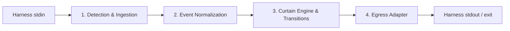

# Universal Agent Plugin Architecture, Packaging & Publishing Guide

Supporting Google Antigravity (AGY), Anthropic Claude Code, and OpenAI Codex from a single repository.

---

## 1. Executive Summary & Core Architecture

Agent harnesses—**Google Antigravity (AGY)**, **Anthropic Claude Code**, **OpenAI Codex CLI**, and **VS Code Copilot**—differ across several core areas:

- **Manifest Locations**: Different directories and filenames (`plugin.json`, `.claude-plugin/plugin.json`, `.codex-plugin/plugin.json`, `.agents/plugins/curtain/plugin.json`).
- **Lifecycle Protocols**: Different event triggers, payload casing (camelCase protojson vs. snake_case JSON), and control signals (exit code `2` vs. JSON stdout decisions).
- **Execution Constraints**: Claude Code and Codex cache plugins without running `npm install`; commands must be pre-bundled and cross-platform.

### Single-Source Strategy

Maintaining separate plugins per harness leads to configuration drift and maintenance overhead. The solution used by `curtain` (and reference plugins like Ponytail) is a universal, single-source design:

1. **Shared Knowledge & Rules**: A single set of `skills/` (`SKILL.md`) and behavioral instructions (`rules/AGENTS.md`) shared across all harnesses.
2. **Dedicated Manifest Zones**: Partitioned manifest directories (`.claude-plugin/`, `.codex-plugin/`, `.agents/`) that co-exist without collision.
3. **Modular Harness Adapters**: Dedicated adapters in `src/harnesses/` implementing a common [`HarnessAdapter`](../src/harnesses/types.ts) interface.
4. **Zero-Dependency Bundled Hook Shim**: A single, bundled script (`dist/curtain.cjs`) built via `esbuild` that auto-detects the host harness, normalizes events, executes core runner logic, and formats egress per harness specification.

---

## 2. Harness Specifications

Detailed specifications, wire schemas, lifecycle protocols, and egress formats are documented in each harness guide:

- [OpenAI Codex CLI Specification](../src/harnesses/codex.md)
- [Anthropic Claude Code Specification](../src/harnesses/claude.md)
- [Google Antigravity (AGY) Specification](../src/harnesses/agy.md)
- [GitHub Copilot / VS Code Agent Specification](../src/harnesses/copilot.md)

---

## 3. Empirical Discoveries & Platform Pitfalls

### 1. The `hooks/hooks.json` Name Collision Trap
- **Issue**: Antigravity automatically scans for and loads any file named `hooks/hooks.json` at the repository root. If that file declares Claude Code hook events (`SessionStart`, `UserPromptSubmit`), Antigravity fails on boot.
- **Fix**: Name the shared Claude/Codex hook manifest `hooks/claude-codex-hooks.json`. Reference it explicitly inside `.claude-plugin/plugin.json` and `.codex-plugin/plugin.json`. Place AGY hooks in `.agents/plugins/curtain/hooks.json`.

### 2. Windows PowerShell Stdin Hang
- **Issue**: On Windows, Claude Code runs hook commands inside PowerShell scriptblocks. PowerShell pipes sometimes fail to send `EOF` to child Node processes. Calling `process.stdin.on('end')` can hang indefinitely.
- **Fix**: Attach an unreferenced timeout fallback to stdin reads:
  ```typescript
  let input = "";
  let handled = false;

  function finish() {
    if (handled) return;
    handled = true;
    runLogic(input);
  }

  process.stdin.on("data", (chunk) => { input += chunk; });
  process.stdin.on("end", finish);
  setTimeout(finish, 1000).unref();
  ```

### 3. Stripping UTF-8 Byte Order Marks (BOM)
- **Issue**: Windows shells prepend `\uFEFF` when piping JSON to standard input, causing `JSON.parse()` to throw a syntax error.
- **Fix**: Strip BOM before parsing: `JSON.parse(rawInput.replace(/^\uFEFF/, ""))`.

### 4. Avoiding `commandWindows` in Manifests
- **Issue**: Claude Code marketplace validators reject `commandWindows` as unrecognized schema.
- **Fix**: Use a single cross-platform command string with quoted paths:
  ```json
  "command": "node \"${CLAUDE_PLUGIN_ROOT}/dist/curtain.cjs\" hook pre"
  ```
  Avoid `exec node`, `command -v`, `&&`, or bashisms that crash PowerShell.

### 5. Zero-Dependency Bundling
- **Issue**: Neither Claude Code nor Codex runs `npm install` during installation. Unbundled runtime dependencies cause `MODULE_NOT_FOUND`.
- **Fix**: Bundle all dependencies into `dist/curtain.cjs` using `esbuild`:
  ```bash
  esbuild src/cli.ts --bundle --platform=node --target=node18 --format=cjs --outfile=dist/curtain.cjs
  ```

---

## 4. Repository Layout

```text
curtain/
├── .agents/                          # Google Antigravity ecosystem
│   └── plugins/
│       ├── marketplace.json          # AGY marketplace catalog
│       └── curtain/
│           ├── plugin.json           # AGY manifest
│           ├── hooks.json            # AGY lifecycle dispatch table
│           ├── rules/AGENTS.md       # Behavioral guidelines
│           └── skills/               # Packaged skills
│
├── .claude-plugin/                   # Claude Code configuration
│   ├── marketplace.json              # Claude Code marketplace catalog
│   └── plugin.json                   # Manifest pointing to hooks & skills
│
├── .codex-plugin/                    # OpenAI Codex configuration
│   └── plugin.json                   # Codex manifest with interface metadata
│
├── hooks/                            # Declarative hook manifests
│   └── claude-codex-hooks.json       # Shared Claude & Codex hook declarations
│
├── skills/                           # Universal skill definitions
│   ├── curtain/SKILL.md              # Start execution
│   ├── next/SKILL.md                 # Advance to next step
│   ├── curtain-drop/SKILL.md         # Abort execution
│   └── curtain-status/SKILL.md       # Runner status
│
├── rules/
│   └── AGENTS.md                     # Behavioral guidelines
│
├── src/
│   ├── harnesses/                    # Harness-specific adapters & docs
│   │   ├── types.ts                  # HarnessAdapter & EgressOutput types
│   │   ├── index.ts                  # Registry & detection router
│   │   ├── codex.ts & codex.md       # Codex adapter & spec
│   │   ├── claude.ts & claude.md     # Claude Code adapter & spec
│   │   ├── agy.ts & agy.md           # Antigravity adapter & spec
│   │   └── copilot.ts & copilot.md   # Copilot adapter & spec
│   │
│   ├── shim/                         # Runtime CLI shim
│   │   ├── runtime-shim.ts           # Entry point: stdin buffering & execution
│   │   └── stdin.ts                  # Stdin reader & JSON parser
│   │
│   ├── handlers/                     # Lifecycle handlers (pre, stop)
│   │   ├── pre.ts                    # User commands & prompt injection
│   │   └── stop.ts                   # Autonomous continuation & gates
│   │
│   ├── lib/                          # Command parsing, debug logger
│   ├── parser.ts                     # Markdown act splitting
│   ├── resolver.ts                   # File resolution & workspace path loader
│   ├── state.ts                      # Disk state serialization (.curtain-state.json)
│   ├── transitions.ts                # State transitions & status mutations
│   └── cli.ts                        # CLI entry point
│
├── dist/
│   └── curtain.cjs                   # Bundled zero-dependency production artifact
│
├── esbuild.config.js                 # Bundler config
├── package.json                      # NPM configuration
├── AGENTS.md                         # Repository behavioral rules
└── README.md                         # Project documentation
```

---

## 5. Hook Shim Pipeline

The hook shim isolates host harness differences from core runner logic through four stages:



### Modular Harness Adapter Architecture

Each harness implements the [`HarnessAdapter`](../src/harnesses/types.ts) interface:

```typescript
export interface HarnessAdapter {
  readonly id: HarnessType;
  detect(payload: Record<string, unknown>, env: NodeJS.ProcessEnv): boolean;
  normalize(
    payload: Record<string, unknown>,
    modeArg?: string,
    env?: NodeJS.ProcessEnv,
  ): NormalizedEvent;
  formatEgress(event: NormalizedEvent, response: HookResponse): EgressOutput;
  extractLatestMessage(event: NormalizedEvent): LatestMessage | null;
}
```

1. **Detection**: Checked in sequence by [`detectHarness`](../src/harnesses/index.ts). Returns `HarnessType | null`. If unhandled, the shim exits `0` with no output.
2. **Normalization**: Performed by `adapter.normalize(payload, modeArg, env)` to build a harness-specific `NormalizedEvent` (`pre`, `stop`, or `tool`) containing the conversation ID, workspace path, prompt, tool call, and `latestMessage`.
3. **Execution**: Core handlers parse commands, update runner state via [`src/transitions.ts`](../src/transitions.ts), and produce a standard `HookResponse`.
4. **Egress**: The adapter translates `HookResponse` into stdout JSON or stderr exit codes matching the host harness.

---

## 6. State Persistence

CLI hooks run as isolated, ephemeral processes. State across turns is persisted to disk keyed by conversation ID:

- Session paths resolve via [`src/state.ts`](../src/state.ts), respecting harness-provided directories (`PLUGIN_DATA`, `CLAUDE_PLUGIN_DATA`, `AGY_PLUGIN_DATA`, `COPILOT_PLUGIN_DATA`) and falling back to temporary directories.
- All state transitions and mutations are centralized in [`src/transitions.ts`](../src/transitions.ts).

---

## 7. Packaging & Publishing Playbook

### 7.1 Anthropic Claude Code
1. Commit `.claude-plugin/marketplace.json` and `.claude-plugin/plugin.json`.
2. Users install via:
   ```bash
   claude plugin marketplace add lukstei/curtain
   claude plugin install curtain@curtain-marketplace
   ```

### 7.2 Google Antigravity (AGY)
1. Commit `.agents/plugins/curtain/plugin.json` and `.agents/plugins/curtain/hooks.json`.
2. Declare in `.agents/plugins/marketplace.json`.
3. Workspace clones immediately inherit the plugin. Global install via:
   ```bash
   agy plugin install https://github.com/lukstei/curtain
   ```

### 7.3 OpenAI Codex CLI
1. Commit `.codex-plugin/plugin.json` referencing `hooks/claude-codex-hooks.json`.
2. Users install and trust the bundle:
   ```bash
   codex plugin marketplace add lukstei/curtain
   codex plugin install curtain
   codex plugin trust curtain
   ```

### 7.4 NPM Registry
1. Build the zero-dependency bundle: `npm run build`.
2. Publish with provenance: `npm publish --provenance --access public`.
